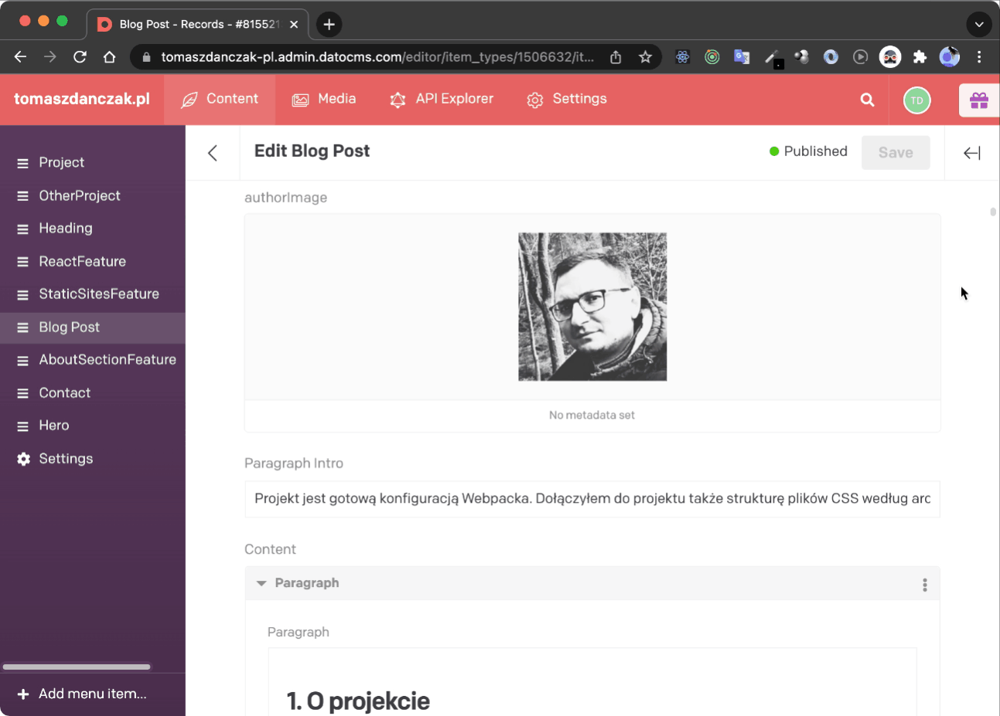
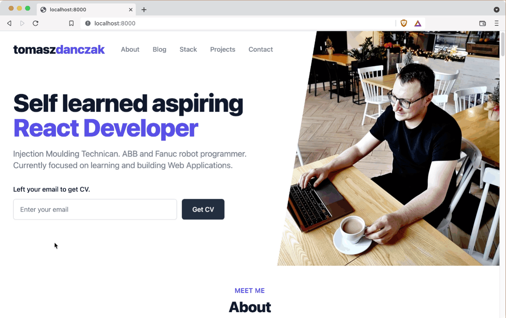

# 🌱  [Tomasz Dańczak Portfolio Project](https://www.tomaszdanczak.pl/)
Source code for [tomaszdanczak.com](https://www.tomaszdanczak.pl/), my personal website.

## Stack
- [Gatsby](https://www.gatsbyjs.com/)
- [GraphQL](https://graphql.org/)
- Headless CMS ([DatoCMS](https://www.datocms.com/))
- [Tailwind CSS](https://tailwindcss.com/)

### License
This is my personal website, but this is not a template.

## 📺 Screenshot GIFs
### 🔴 The whole content is stored in DatoCMS and loaded from there into the app using GraphQL

### 🔴 Pages with posts are created automatically using data from Data CMS

